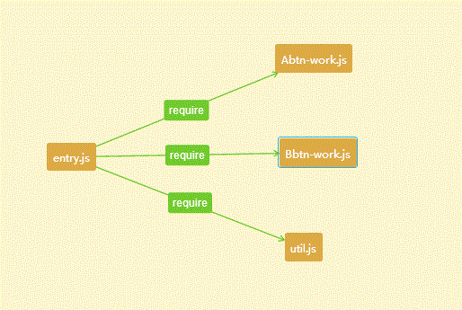
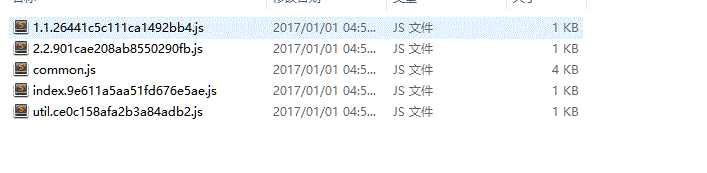
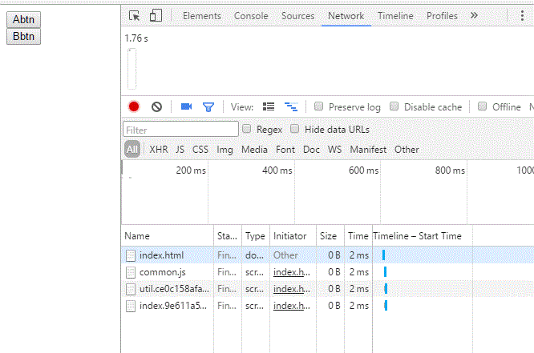
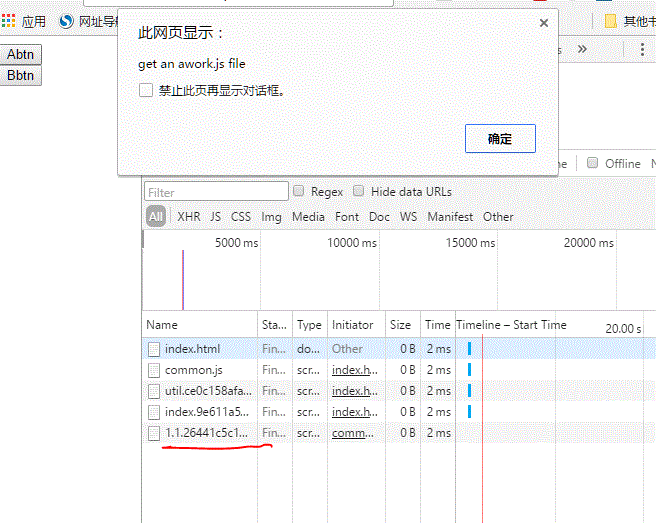
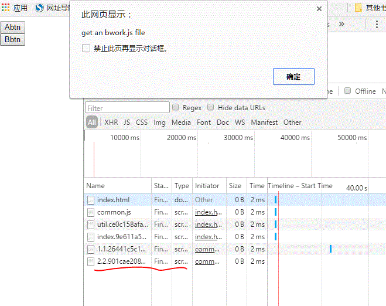

## webpack异步加载的原理

webpack ensure相信大家都听过。有人称它为异步加载，也有人说做代码切割，那这
个家伙到底是用来干嘛的？其实说白了，它就是把js模块给独立导出一个.js文件的，然后使用这个
模块的时候，webpack会构造script dom元素，由浏览器发起异步请求这个js文件。

场景分析:

比如应用的首页里面有个按钮，点击后可以打开某个地图。打开地图的话就要利用百度地图的js,于是
我们不得不在首页中把百度地图的js一起打包进去首页,一个百度地图的js文件是非常大的，假设为
1m，于是就造成了我们首页打包的js非常大，用户打开首页的时间就比较长了。

有没有什么好的解决方法呢？

**解决1**

既然打包成同一个js非常大的话，那么我们完全可以把百度地图js分类出去，利用浏览器的并发请求
js文件处理，这样的话，会比加载一个js文件时间小得多。嗯，这也是个不错的方案。为baidumap.js
配置一个新的入口就行了，这样就能打包成两个js文件，都插入html即可（如果baidumap.js被多个
入口文件引用的话，也可以不用将其设置为入口文件，而且直接利用CommonsChunkPlugin,导出到一个
公共模块即可）可以参考我之前文章
[webpack模块打包](https://github.com/yongningfu/webpack_package)

那还有没有更好的解决方案呢？

**解决2**

当然还是有的！我们细想，百度地图是用户点击了才弹出来的，也就是说，这个功能是可选的。那么解决
方案就来了，能不能在用户点击的时候，我在去下载百度地图的js.当然可以。那如何实现用户点击的时候
再去下载百度地图的js呢？于是，我们可以写一个按钮的监听器

```js
mapBtn.click(function() {
  //获取 文档head对象
  var head = document.getElementsByTagName('head')[0];
  //构建 <script>
  var script = document.createElement('script');
  //设置src属性
  script.async = true;
  script.src = "http://map.baidu.com/.js"
  //加入到head对象中
  head.appendChild(script);
})
```
上面的几行代码对大家来说都不难。可以在点击的时候，才加载百度地图，等百度地图加载完成后，在
利用百度地图的对象去执行我们的操作。ok，讲到这里webpack.ensure的原理也就讲了一大半了。
它就是 **把一些js模块给独立出一个个js文件，然后需要用到的时候，在创建一个script对象，加入
到document.head对象中即可**，浏览器会自动帮我们发起请求，去请求这个js文件，在写个回调，去
定义得到这个js文件后，需要做什么业务逻辑操作。

ok,那么我们就利用webpack的api去帮我们完成这样一件事情。点击后才进行异步加载百度地图js，上面
的click加载js时我们自己写的，webpack可以轻松帮我们搞定这样的事情，而不用我们手写

```js
mapBtn.click(function() {
  require.ensure([], function() {
    var baidumap = require('./baidumap.js') //baidumap.js放在我们当前目录下
  })
})
```
搞定！当然还是分析一下。require.ensure这个函数是一个代码分离的分割线，表示 回调里面的require
是我们想要进行分割出去的，即require('./baidumap.js')，把baidumap.js分割出去，形成一个
webpack打包的单独js文件。当然ensure里面也是可以写一些同步的require的，比如

```js

var sync = require('syncdemo.js')   //下面ensure里面也用到

mapBtn.click(function() {
  require.ensure([], function() {
    var baidumap = require('./baidumap.js') //baidumap.js放在我们当前目录下
    var sync = require('syncdemo.js')  //这个不会独立出去，因为它已经加载到模块缓存中了
  })
})
```
也就是说，ensure会把没有使用过的require资源进行独立分成成一个js文件. require.ensure的
第一个参数是什么意思呢？[], 其实就是 当前这个 require.ensure所依赖的其他 异步加载的模块。你想啊？如果A 和 B都是异步加载的，B中需要A，那么B下载之前，是不是先要下载A啊？，所以ensure的第一个参数[]
也是请求下载的模块，如果想加载A require.ensure(['A.js'],function) 即可

说完了上面的原理。下面就实践一下



entry.js 依赖三个 js。

- Abtn-work.js 是封装了 abtn按钮点击后，才执行的业务逻辑
- Bbtn-work.js 是封装了 bbtn按钮点击后，才执行的业务逻辑
- util.js 是封装了 entry.js需要利用的工具箱

针对上面的需求，**优化方案**

假设 Abtn-work.js Bbtn-work.js util.js都是非常大的文件
因为 Abtn-work.js Bbtn-work.js 都不是entry.js必须有的，即可能发生的操作，那么我们把
他们利用异步加载，当发生的时候再去加载就行了

util.js是entry.js立即马上依赖的工具箱。但是它又非常的大，所以将其配置打包成一个公共模块，
利用浏览器的并发加载，加快下载速度。ok,构思完成，开始实现

index.html
```html
<!DOCTYPE html>
<html>
  <head>
    <meta charset="utf-8">
    <title>index</title>
  </head>
  <body>
    <div id="aBtn">Abtn</div>
    <div id="bBtn">Bbtn</div>
  </body>
</html>
```

定义了两个buttom

然后看看 entry.js

```js

var util_sync = require('./util-sync.js')

alert(util_sync.data)

document.getElementById("aBtn").onclick = function() {

  require.ensure([], function() {
    var awork = require('./workA-async.js')
    alert(awork.data)
    //异步里面再导入同步模块--实际是使用同步中的模块
    var util1 = require('./util-sync.js')
  })
}

document.getElementById("bBtn").onclick = function() {

  require.ensure([], function() {
    var bwork = require('./workB-async.js')
    alert(bwork.data)
  })
}
```

可以看到，workA-async.js， workB-async.js 都是点击后才ensure进来的。什么时候加载完成呢？
就是 require.ensure() 第二个函数参数，即回调函数，它表示当下载js完成后，发生的因为逻辑

webpack打包后，形成



其实， 1.1....  2.2...就是我们ensure导出来的js文件

我们看看代码是如何加载的执行的，点击打包插入js后的html



可以看到，并没有加载 ensure导出来的 1.1...js    2.2....js

点击 abtn,



发现浏览器下载并加载了 1.1....js

点击 bbtn


发现浏览器下载并加载了 2.2....js

ok 全部完成

## todo: 异步公用模块的代码抽离

**喜欢的话 欢迎star**
